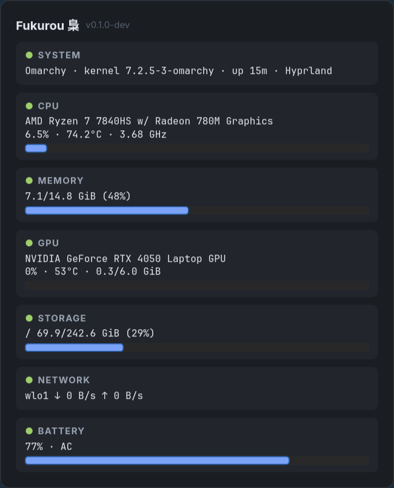

# Fukurou 梟 — Watch your system.

Lightweight floating system dashboard for Linux (Wayland/Hyprland).
Read-only: observe, don't control. No root, no telemetry, no network calls.

> Status: **v0.1.0** — floating dashboard, 7 live modules, config wired.

## Requirements

Linux + Wayland (Hyprland recommended), system libs:

```bash
# Arch/Omarchy
sudo pacman -S gtk4 gtk4-layer-shell
# Ubuntu 24.04+
sudo apt install libgtk-4-dev libgtk4-layer-shell-dev
```

X11 without Wayland works degraded (plain window, no layer-shell).

## Install

```bash
git clone https://github.com/RakhaYandra/fukurou
cd fukurou
make install   # builds to ~/.local/bin/fukurou
```

Hyprland keybind (`configs/hyprland.conf.example`):

```ini
bind = SUPER, F, exec, fukurou
```

Keys in panel: `ESC`/`q` dismiss, `r` force refresh.

## Quickstart

```bash
go build -o bin/fukurou ./cmd/fukurou
./bin/fukurou --debug
./bin/fukurou --version
```

## Configuration

File: `~/.config/fukurou/config.yaml` (override with `--config PATH`).
Template: `configs/config.example.yaml`. Hyprland bind example:
`configs/hyprland.conf.example`.

```yaml
panel:
  width: 520        # 320–1200, clamped
  position: center  # center | top | bottom (other → center)
  opacity: 0.96     # 0.3–1.0, clamped
refresh:
  interval: 1s      # 250ms–5s, clamped
modules:
  cpu: true         # false hides the card entirely
  gpu: false
```

Rules: missing file → defaults silently (first run). Invalid YAML →
stderr warning + safe defaults, never crash. No restart-daemon: relaunch
to apply (single-shot model).

## Layout

```text
cmd/fukurou/          entrypoint (flags, signals)
internal/config/      YAML + defaults + validation
internal/collectors/  Collector interface + metric models
internal/app/         composition root
configs/              example config
docs/                 public architecture overview
```

Full product spec lives in the private `fukurou-internal` repo.

## Principles

Fast · Minimal · Readable · Non-intrusive · Read-only · Extensible

## Screenshots



## Troubleshooting

| Symptom | Cause / fix |
| --- | --- |
| Plain window, not floating | No Wayland (`WAYLAND_DISPLAY` empty) → X11 fallback, still usable |
| `GPU information unavailable` | No NVIDIA/AMD detected (Intel iGPU not read in v0.1) |
| `battery unavailable` | Desktop without battery — normal |
| Config ignored | Invalid YAML → stderr warning + defaults; check with `--debug` |
| `Unknown option --config` | Fixed in v0.1.0 (flags no longer leak to GTK) |

## License

MIT
